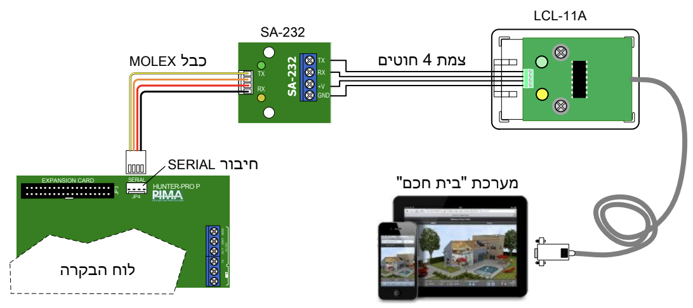
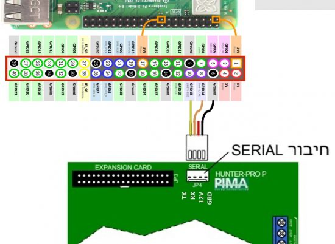

# PIMA2MQTT

This program implements an interface for negotiation with [PIMA Hunter Pro alarms](https://www.pima-alarms.com/our-products/hunter-pro-series/).  
It was built based on PIMA&trade;'s General Specification for Home Automation &
Building Management protocol Ver. 1.15.  
PIMA&trade; is a trademark of PIMA Electronic Systems Ltd, http://www.pima-alarms.com.  
This program was built with no affiliation of PIMA Electronic Systems Ltd.

## Prerequisites
1. PIMA Hunter Pro alarm&trade;, with 32, 96 or 144 zones.
1. PIMA Home Automation kit&trade; (`SA-232`, `LCL-11A` and Serial-to-USB cable), or `net4pro` ethernet connection.
   Diagram by PIMA&trade; &copy;:
   
   - According to various users, the alarm can be alternatively connected using a `PL2303TA` USB-to-TTL cable, like [this one](https://www.aliexpress.com/item/32345829369.html).
   - Yet another option is to connect directly to Raspberry pi, as specified here:
   
1. Raspberry Pi or similar, connected to the alarm through the Home Automation kit.
   - Tested on [Raspbian](https://www.raspberrypi.org/downloads/raspbian/). Other operating systems
     may use different path structure for the serial ports.
1. Alarm technician login code. Unfortunately, it is not possible to connect to the alarm using a user login code.

## Enabling the alarm serial port or network connection
1. Enable extended menus:
   - Primary login code
   - `NEXT`
   - Technician login code
   - `5` (General parameters)
   - `ENTR`
   - `NEXT` till you get to the right `P` (extended menus)
   - Toggle by `#`
   - `ENTR`
   - `END` to exit
1. Enable the serial port:
   - Primary login code
   - `NEXT`
   - Technician login code
   - `3` (Communication)
   - `ENTR`
   - 8 x `NEXT` (Serial port)
   - `ENTR`
   - Toggle the first `L` (for serial connection) or first `N` (for net4pro) by `#`
   - `ENTR`
   - `END` to exit

## How to run

- [Command Line](docs/command_line.md)
- [Docker](docs/docker.md)

1. If you use [MQTT](http://en.wikipedia.org/wiki/Mqtt) for [HomeAssistant](https://www.home-assistant.io/) or
   [openHAB](https://www.openhab.org/), the broker should now provide the updated status of the alarm, and accepts commands.
   Basic yaml config files for HomeAssistant are available under the [hass](hass/) directory.
    
## Next steps
1. [Groovy](http://groovy-lang.org/) [Device Type Handlers](https://docs.smartthings.com/en/latest/device-type-developers-guide/) for [SmartThings](https://www.smartthings.com/) integration.
1. Support further functionality, e.g. change user codes.
